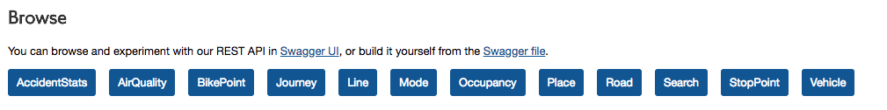

```{r setup, include=FALSE}
knitr::opts_chunk$set(echo = FALSE)
```

## 

<h3>The transport system in London is a low-crime environment, and the risk of becoming a victim of crime while travelling on it is low.</h1>

<iframe src="https://giphy.com/embed/3o7TKMnesxRQkgHQ6k" width="480" height="330" frameBorder="0" class="giphy-embed" allowFullScreen></iframe>

<p1><a href="https://giphy.com/gifs/london-buzzfeed-tube-3o7TKMnesxRQkgHQ6k">source</a></p1>

##
<h4>In fact, the rate is under 8 crimes per 1 million passenger journeys</h4>

```{r, echo=FALSE, warning=FALSE}
library(ggplot2)
x <- c(1, 2)
y <- c(1, 1)
z <- c(0.0024, 300)
dat <- data.frame(x, y, z)

ggplot(dat, aes(x, y, size = z)) + geom_point() +
  scale_size_continuous(guide=FALSE, range = c(0.0001,300)) +
  theme(axis.line=element_blank(),axis.text.x=element_blank(),
          axis.text.y=element_blank(),axis.ticks=element_blank(),
          axis.title.x=element_blank(),
          axis.title.y=element_blank(),legend.position="none",
          panel.background=element_blank(),panel.border=element_blank(),
        panel.grid.major=element_blank(),
          panel.grid.minor=element_blank(),plot.background=element_blank())
```

<p1><a href="http://content.tfl.gov.uk/crime-and-antisocial-behaviour-bulletin-q31617.pdf">source</a></p1>

##

<h3> But... </h3>

<iframe src="https://giphy.com/embed/6U4v1NPgaonDi" width="480" height="269" frameBorder="0" class="giphy-embed" allowFullScreen></iframe><p1><a href="https://giphy.com/gifs/bird-chips-running-6U4v1NPgaonDi">source</a></p1>

<p>Crime, antisocial behaviour and the fear of crime can affect on people's willingness to travel and access jobs and services.</p>

##
<h3> So we turn to data...</h3>

<iframe src="https://giphy.com/embed/xUA7aV9ZmC8jN1nboc" width="480" height="270" frameBorder="0" class="giphy-embed" allowFullScreen></iframe><p1><a href="https://giphy.com/gifs/batman-lego-gordon-xUA7aV9ZmC8jN1nboc">source</a></p1>

##
<h3>4 main ways we use(d) R</h3>

- Data cleaning
- Analysis
- Visualisation and mapping
- Shiny apps for dashboards

##BUT FIRST

<h3>Working on R in closed systems</h3>

- Installation/ update issues
- Downloading packages
- Security concerns
- Training support
    + [User Group](https://github.com/RClubCoders)
    + Lunchtime sessions


##Example: TfL API

<h3>Normally: </h3>

```{r, echo=TRUE, warning=FALSE, eval=FALSE}

library(jsonlite)

query_url <- "https://api.tfl.gov.uk/AccidentStats/2015?app_id=your_app_id_here&app_key=your_app_key_here"

d <- fromJSON(query_url)

accidents <- data.frame(lapply(as.data.frame(d), as.character), stringsAsFactors=FALSE)

```

##
<h3>From inside firewall: </h3>


```{r, echo=TRUE, warning=FALSE, eval=FALSE}

library(jsonlite)

query_url <- "https://api.tfl.gov.uk/AccidentStats/2015?app_id=your_app_id_here&app_key=your_app_key_here"

l <- readLines(query_url)

d <- fromJSON(l)

accidents <- data.frame(lapply(as.data.frame(d), as.character), stringsAsFactors=FALSE)

```

##
<h3> But once we got it... </h3>

##Choropleth maps

```{r, echo=TRUE, warning=FALSE, eval=FALSE}
library(ggplot2)
```

```{r, out.width = "800px", echo=FALSE}
knitr::include_graphics('ggplot2.png')
```

##Point pattern analysis

```{r, echo=TRUE, warning=FALSE, eval=FALSE}
library(spatstat)
```

```{r, out.width = "800px", echo=FALSE}
knitr::include_graphics('spatstat.png')
```

##Spatial autocorrelation

```{r, echo=TRUE, warning=FALSE, eval=FALSE}
library(spdep)
```

```{r, out.width = "800px", echo=FALSE}
knitr::include_graphics('spdep.png')
```

##Aoristic analysis

```{r, echo=TRUE, warning=FALSE, eval=FALSE}
library(aoristic)
```

```{r, out.width = "800px", echo=FALSE}
knitr::include_graphics('aoristic.png')
```

##Other types of analysis

- Geographic profiling - Rgeoprofile
- Crime series identification - crimelinkage
- Text mining - tm
- Network analysis - igraph

##Shiny dashboards

- Pro tip: the best way to get senior management on board!
- Large initial time investment, but soon pays off
- Internal hosting can be a challenge

##Estimate 'harm'
```{r, out.width = "800px", echo=FALSE}
knitr::include_graphics('crimeHarm.png')
```

##Analyse tweets
```{r, out.width = "800px", echo=FALSE}
knitr::include_graphics('nightTubeTweets.png')
```

##Track trends
```{r, out.width = "800px", echo=FALSE}
knitr::include_graphics('performanceTrends.png')
```

##Monitor fare evasion

```{r, out.width = "800px", echo=FALSE}
knitr::include_graphics('beApp.png')
```

##TfL Open Data
https://tfl.gov.uk/info-for/open-data-users/


##Lots of topics


##Get AccStats


##In R: Set up API


```{r, echo=TRUE}

library(httr)
library(jsonlite)

app_key <- "put app key here"
app_id <- "put app id here"
year <- "2015"
```

```{r, echo=FALSE}
app_key <- "6c47ac149cfec9ccb6bf32b953a85dd3"
app_id <- "0f1de667"
```

##In R: Build query and get data

```{r, echo=TRUE}
queryString <- paste0("https://api.tfl.gov.uk/AccidentStats/",
                      year,
                      "?app_id=",
                      app_id,
                      "&app_key=",
                      app_key)

l <- readLines(queryString)

d <- fromJSON(l)

accidents <- data.frame(lapply(as.data.frame(d), as.character), stringsAsFactors=FALSE)
```


##In R

```{r, echo=TRUE}
head(accidents, n = 1)

```


##Visualise

[https://rekarrr.shinyapps.io/tfl2015accstats/](https://rekarrr.shinyapps.io/tfl2015accstats/)


##Get in touch!

- Email: reka.solymosi@manchester.ac.uk
- Twitter: @r_solymosi
- Methods at Manchester summer school
    + http://www.methods.manchester.ac.uk/connect/events/summer-school/courses/
    + Select: 'Getting started with R...'
